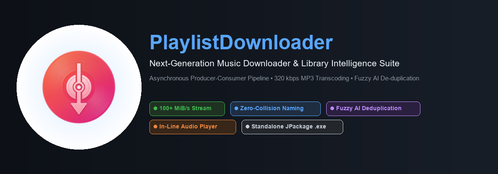
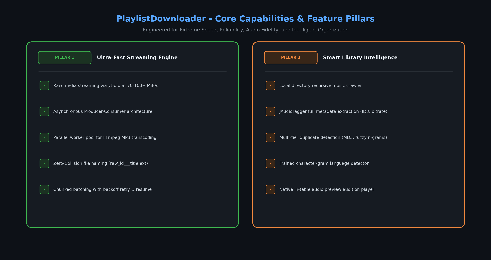
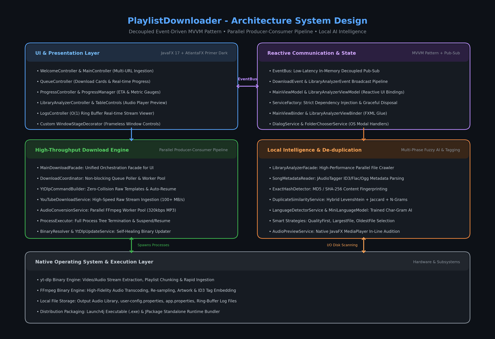
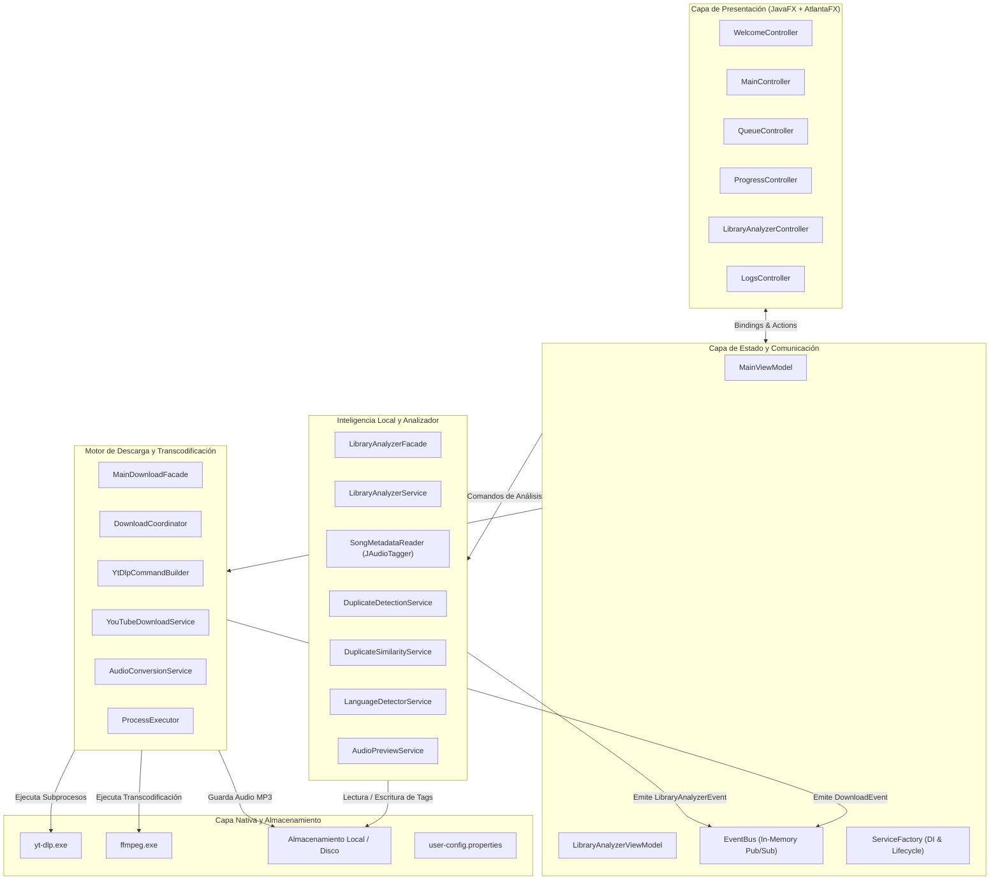
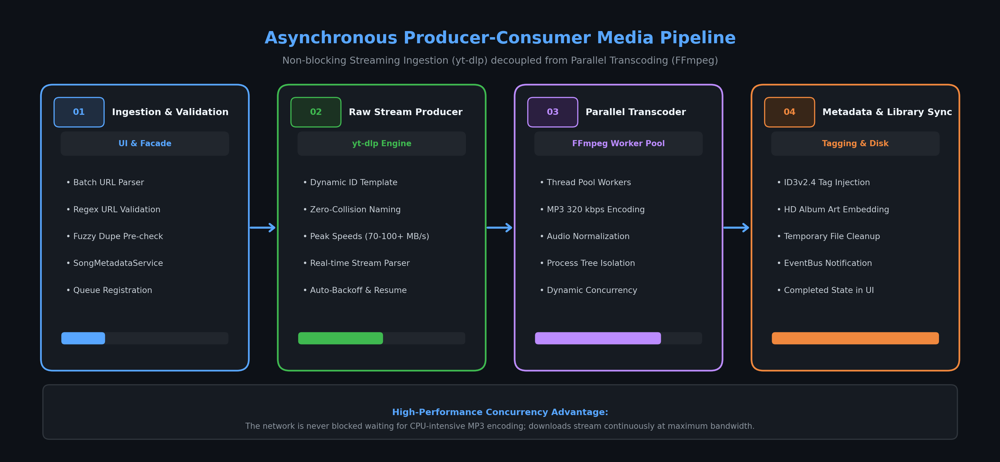
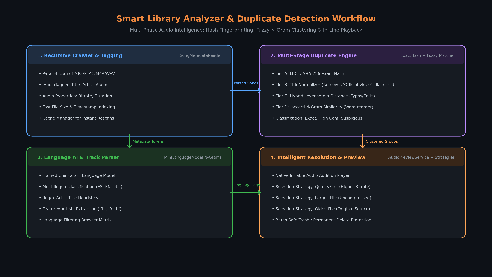
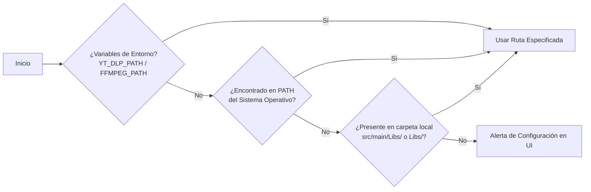

<p align="center">
  
</p>

<p align="center">
  
</p>

<h1 align="center">PlaylistDownloader</h1>

<p align="center">
  <strong>Suite de escritorio de alto rendimiento para descarga masiva de música y gestión inteligente de bibliotecas locales.</strong><br>
  <em>Impulsado por JavaFX 17, AtlantaFX Primer Dark, arquitectura asíncrona Productor-Consumidor (yt-dlp + FFmpeg) y motor de desduplicación con IA difusa.</em>
</p>

<p align="center">
  <a href="https://www.oracle.com/java/technologies/javase/jdk17-archive-downloads.html"></a>
  <a href="https://openjfx.io/"></a>
  <a href="https://mkpaz.github.io/atlantafx/"></a>
  <a href="https://github.com/yt-dlp/yt-dlp"></a>
  <a href="https://ffmpeg.org/"></a>
  <a href="#"></a>
  <a href="#"></a>
  <a href="LICENSE"></a>
</p>

---

## Tabla de Contenidos

1. [Visión General](#vision-general)
2. [Pilares y Capacidades Principales](#pilares-y-capacidades-principales)
3. [Arquitectura del Sistema](#arquitectura-del-sistema)
4. [Pipeline de Descarga y Transcodificación](#pipeline-de-descarga-y-transcodificacion)
5. [Analizador Inteligente de Biblioteca y Duplicados](#analizador-inteligente-de-biblioteca-y-duplicados)
6. [Requisitos del Sistema e Instalación](#requisitos-del-sistema-e-instalacion)
7. [Guía de Uso del Producto](#guia-de-uso-del-producto)
8. [Compilación, Pruebas y Empaquetado](#compilacion-pruebas-y-empaquetado)
9. [Estructura del Proyecto](#estructura-del-proyecto)
10. [Configuración y Personalización](#configuracion-y-personalizacion)
11. [Preguntas Frecuentes y Diagnóstico](#preguntas-frecuentes-y-diagnostico)
12. [Créditos y Licencia](#creditos-y-licencia)

---

<a id="vision-general"></a>
## Visión General

**PlaylistDownloader** es una aplicación de escritorio profesional desarrollada bajo estándares de arquitectura empresarial para resolver los cuellos de botella clásicos en la descarga y organización de música digital:

* **El problema de las descargas bloqueantes:** Las herramientas convencionales congelan la red o la interfaz mientras convierten audio pesado de forma síncrona.
* **El problema de la colisión de nombres:** Descargar listas completas suele provocar sobreescrituras accidentales o pistas truncadas con títulos genéricos.
* **El caos de bibliotecas duplicadas:** Las colecciones de música locales acumulan versiones repetidas con ligeras variaciones de nombre, bitrates desiguales o etiquetas incompletas.

**PlaylistDownloader** soluciona esto combinando:
1. Un **pipeline asíncrono desacoplado** (Productor-Consumidor) que exprime el ancho de banda descargando streams a 70–100+ MiB/s mientras un pool de trabajadores FFmpeg procesa MP3 a 320 kbps en paralelo.
2. Un **analizador inteligente de biblioteca local** con detección de duplicados multicapa (MD5 exacto, Levenshtein, Jaccard por N-gramas y detector de idioma por N-gramas de caracteres).
3. Una **interfaz gráfica moderna** basada en JavaFX y el tema *AtlantaFX Primer Dark*, con visualización de registros en tiempo real en un búfer circular de rendimiento $O(1)$.

---

<a id="pilares-y-capacidades-principales"></a>
## Pilares y Capacidades Principales

<p align="center">
  
</p>

### 1. Pipeline Asíncrono Productor-Consumidor
* **Descarga de streams puros a velocidad máxima:** `yt-dlp` captura flujos de audio sin comprimir a velocidades de entre 70 y 100+ MiB/s.
* **Transcodificación desacoplada en segundo plano:** `AudioConversionService` procesa la conversión a MP3 (320 kbps constante / VBR de alta fidelidad) en un pool de hilos de trabajo (`Worker Pool`), garantizando que la red nunca espere a la CPU.
* **Procesamiento de listas por lotes fraccionados:** Algoritmos de fragmentación (`chunked batching`) con reintentos inteligentes y retroceso exponencial (`exponential backoff`).

### 2. Nomenclatura Anti-Colisión y Resumen de Sesión
* **Plantilla dinámica única:** Uso de `raw_%(id)s___%(title)s.%(ext)s` para garantizar que ningún archivo colisione con otro, incluso con canciones de nombres idénticos o listas mixtas.
* **Reanudación automática:** Detección de descargas parciales y auto-resunción transparente de transferencias incompletas.
* **Ingesta masiva de URLs:** Permite pegar múltiples enlaces separados por comas, espacios o saltos de línea de una sola vez.

### 3. Inteligencia de Biblioteca y Desduplicación Avanzada
* **Indexación recursiva rápida:** Rastreador de carpetas locales para formatos `.mp3`, `.m4a`, `.flac`, `.wav` y `.ogg`.
* **Fusión de similitud híbrida:**
  * **Nivel A (Exacto):** Huella digital hash MD5 / SHA-256.
  * **Nivel B (Normalización sintáctica):** Supresión de sufijos (*"Official Video"*, *"Audio Oficial"*, *"Remastered"*, acentos y caracteres especiales).
  * **Nivel C (Distancia Levenshtein):** Tolerancia ante erratas y variaciones tipográficas.
  * **Nivel D (Similitud Jaccard por N-Gramas):** Manejo de inversión de palabras (*"Artista - Canción"* vs *"Canción - Artista"*).
* **Detector de Idioma Integrado:** Modelo de clasificación lingüística basado en N-gramas de caracteres (`MiniLanguageModel`).
* **Reproductor de Audio Nativo:** Preescucha instantánea integrada directamente en la tabla del analizador (`AudioPreviewService`) con controles de reproducción/pausa.
* **Estrategias de resolución automática:** Selección con un clic según mejor calidad (`QualityFirstStrategy`), mayor tamaño (`LargestFileStrategy`) o archivo más antiguo (`OldestFileStrategy`).

### 4. Experiencia de Usuario y Diagnóstico en Vivo
* **Diseño AtlantaFX Primer Dark:** Estética moderna, limpia y libre de marcos obsoletos, acompañada de iconografía vectorial con **Ikonli**.
* **Consola de Registros en Tiempo Real:** Visor interno con búfer circular de rendimiento $O(1)$ (`LogService`), filtrado por nivel de severidad y exportación rápida.
* **Gestión Segura del Árbol de Procesos:** `ProcessExecutor` controla el árbol de procesos nativos con capacidad para pausar, reanudar o forzar cierre limpio sin dejar procesos huérfanos en el sistema operativo.

---

<a id="arquitectura-del-sistema"></a>
## Arquitectura del Sistema

La aplicación sigue el patrón arquitectónico **MVVM (Model-View-ViewModel)** combinado con un **EventBus desacoplado** de mensajería reactiva en memoria y un sistema de inyección de dependencias centralizado (`ServiceFactory`).

<p align="center">
  
</p>

### Representación Modular



---

<a id="pipeline-de-descarga-y-transcodificacion"></a>
## Pipeline de Descarga y Transcodificación

El motor de descarga opera como una **tubería de flujo continuo asíncrono**. A diferencia de los programas que descargan un archivo y lo convierten antes de pasar al siguiente, **PlaylistDownloader desacopla la recepción del flujo de red de la codificación en disco**.

<p align="center">
  
</p>

### Fases de Ejecución:

| Fase | Componente | Acción Técnica |
| :--- | :--- | :--- |
| **01. Ingesta y Validación** | `MainDownloadFacade` / `QueueManager` | Ingesta masiva de URLs, validación de sintaxis, consulta preliminar de duplicados locales y registro de tarjeta de progreso. |
| **02. Productor de Audio Crudo** | `YouTubeDownloadService` & `yt-dlp` | Descarga de alta velocidad mediante sockets concurrentes usando la plantilla `raw_%(id)s___%(title)s.%(ext)s`. |
| **03. Transcodificador Paralelo** | `AudioConversionService` & `FFmpeg` | Pool de hilos de trabajo independientes que detectan archivos crudos terminados y los codifican a MP3 (320 kbps) con normalización de audio. |
| **04. Metadatos y Sincronización** | `SongMetadataService` & `EventBus` | Inyección de etiquetas ID3v2.4 (Título, Artista, Álbum, Año) e incrustación de carátula en alta definición. Limpieza de archivos `.raw` temporales. |

---

<a id="analizador-inteligente-de-biblioteca-y-duplicados"></a>
## Analizador Inteligente de Biblioteca y Duplicados

Una de las herramientas más potentes integradas en **PlaylistDownloader** es su suite de inteligencia local para auditar colecciones musicales existentes:

<p align="center">
  
</p>

### Funcionamiento del Motor de Similitud:

1. **Rastreo Recursivo:** Escanea la carpeta seleccionada y utiliza `JAudioTagger` para extraer duración exacta, tasa de bits (bitrate), formato de audio y etiquetas ID3.
2. **Normalización Lingüística:** El `TitleNormalizer` remueve etiquetas acústicas redundantes (`[Official Music Video]`, `(Remastered 2021)`, `feat.`, acentos ortográficos y caracteres especiales).
3. **Puntuación Híbrida:**
   $$\text{Score} = w_1 \cdot \text{LevenshteinSim} + w_2 \cdot \text{JaccardNGrams} + w_3 \cdot \text{DurationMatch}$$
4. **Clasificación por Grupos:**
   * **Exacto (100%):** Hash MD5/SHA-256 coincidente o títulos normalizados idénticos con misma duración.
   * **Alta Confianza (>85%):** Mismo artista y título con ligeras discrepancias en remasters o años.
   * **Sospechoso (>70%):** Posible versión en vivo, acústica o inversión de artista/tema.
5. **Audición Inmediata:** La columna de reproducción permite escuchar al instante ambas pistas en paralelo sin salir de la aplicación para que el usuario tome una decisión certera.
6. **Resolución en Lote:** Aplica estrategias inteligentes (`QualityFirst`, `LargestFile`, `OldestFile`) para marcar automáticamente el archivo prescindible y enviarlo a la papelera o eliminarlo con total seguridad.

---

<a id="requisitos-del-sistema-e-instalacion"></a>
## Requisitos del Sistema e Instalación

### Requisitos Mínimos:
* **Sistema Operativo:** Windows 10/11 (64-bit), macOS 11+, o Linux (glibc 2.31+).
* **Java:** JDK o JRE 17 instalado (no requerido si se utiliza el instalador autónomo generado con `jpackage`).
* **Conexión a Internet:** Para streaming y consulta de metadatos.

### Dependencias Externas:
La aplicación requiere los ejecutables de **yt-dlp** y **FFmpeg**. Se resuelven automáticamente en el siguiente orden de prioridad:



#### Opción A: Instalación en el Sistema con Winget (Recomendado en Windows)
```powershell
winget install -e yt-dlp.yt-dlp
winget install -e FFmpeg.FFmpeg
```

#### Opción B: Copiado Directo en el Proyecto (Portabilidad Total)
Coloca los binarios directamente en la carpeta `Libs/` en la raíz del proyecto o en `src/main/Libs/`:
```text
PlaylistDownloader/
├── Libs/
│   ├── yt-dlp.exe
│   └── ffmpeg.exe
```

---

<a id="guia-de-uso-del-producto"></a>
## Guía de Uso del Producto

### 1. Ingesta y Descarga de Listas
1. Inicia la aplicación y navega a la pantalla **Principal** o **Cola**.
2. Pega una o varias URLs en el campo superior (soporta enlaces de YouTube, listas de reproducción completas o combinaciones de URLs separadas por comas o saltos de línea).
3. Selecciona la carpeta destino de música.
4. Pulsa **Iniciar Descarga**. Podrás ver el progreso individual de cada canción, la velocidad de transferencia en MiB/s y el tiempo estimado restante (ETA).

### 2. Auditoría y Limpieza de Duplicados
1. Haz clic en el botón **Analizar Biblioteca** en el menú superior o lateral.
2. Selecciona la carpeta de música que deseas auditar.
3. El sistema rastreará los temas y agrupará los duplicados encontrados clasificados por nivel de confianza.
4. Utiliza el **botón de reproducción nativo** dentro de la tabla para escuchar y comparar la calidad acústica de las versiones en conflicto.
5. Selecciona una estrategia automática (ej. *Conservar Mejor Calidad*) y pulsa **Resolver Duplicados**.

### 3. Visor de Diagnóstico y Logs en Vivo
1. Dirígete a la sección de **Registros (Logs)**.
2. Observa en tiempo real la salida de los procesos de descarga y transcodificación con coloreado por severidad (`INFO`, `WARN`, `ERROR`).
3. El visor cuenta con un búfer circular de rendimiento $O(1)$ que previene el consumo excesivo de memoria RAM sin importar la cantidad de horas continuas de uso.

---

<a id="compilacion-pruebas-y-empaquetado"></a>
## Compilación, Pruebas y Empaquetado

El proyecto incluye el Maven Wrapper oficial para una compilación reproducible en cualquier equipo sin necesidad de configurar variables globales.

### Ejecutar en Modo Desarrollo:
```powershell
# Windows
.\mvnw.cmd clean javafx:run

# Linux / macOS
./mvnw clean javafx:run
```

### Ejecutar Pruebas Unitarias Automatizadas:
```powershell
.\mvnw.cmd test
```

### Empaquetar JAR Ejecutable y Binario Launch4j (`.exe` liviano):
```powershell
.\mvnw.cmd clean package -DskipTests
```
* **JAR ejecutable resultante:** `target/PlaylistDownloader.jar`
* **Ejecutable nativo generado:** `target/PlaylistDownloader.exe`

### Generar Instalador Autónomo de Windows (`jpackage` con JRE embebido):
El script oficial empaqueta un instalador profesional que no requiere que el usuario final tenga Java instalado:
```powershell
.\create_installer.ps1
```
* **Instalador final resultante:** `target/installer/PlaylistDownloader-1.0.0.exe` (incluye accesos directos al escritorio, menú inicio y desinstalador estándar).

---

<a id="estructura-del-proyecto"></a>
## Estructura del Proyecto

```text
PlaylistDownloader/
├── .mvn/                       # Configuración y binarios de Maven Wrapper
├── docs/                       # Documentación técnica y recursos visuales
│   ├── images/                 # Diagramas de arquitectura, banners y logo oficial
│   └── generate_diagrams.py    # Generador automatizado de diagramas de alta resolución
├── installer/                  # Recursos y plantillas para el empaquetado nativo
├── src/
│   ├── main/
│   │   ├── java/com/example/interfaz/
│   │   │   ├── app/            # Lanzadores principales (Main, Launcher)
│   │   │   ├── config/         # Gestor centralizado de configuración
│   │   │   ├── controller/     # Controladores FXML de vistas
│   │   │   ├── event/          # EventBus desacoplado e infraestructura Pub/Sub
│   │   │   ├── factory/        # Inyección de dependencias (ServiceFactory)
│   │   │   ├── model/          # Modelos de dominio (Canciones, Analizador)
│   │   │   ├── service/        # Lógica de negocio:
│   │   │   │   ├── analyzer/   # Motor de detección de duplicados, tags y similitud
│   │   │   │   ├── download/   # Orquestador de descargas, transcodificación y procesos
│   │   │   │   ├── ui/         # Vistas, temas, decoradores y diálogos
│   │   │   │   └── update/     # Actualizador automático y verificador de hashes
│   │   │   ├── util/           # Utilidades de archivos y formateadores
│   │   │   └── viewmodel/      # ViewModels reactivos (MVVM)
│   │   └── resources/
│   │       ├── app.ico / png   # Logotipo e iconos del sistema
│   │       ├── *.fxml          # Vistas declarativas JavaFX
│   │       ├── styles.css      # Hoja de estilos con AtlantaFX Primer Dark
│   │       └── logback.xml     # Configuración de registro estructurado
│   └── test/                   # Suite de pruebas unitarias con JUnit 5
├── create_installer.ps1        # Script PowerShell para generación del instalador
├── pom.xml                     # Configuración de dependencias Maven
└── README.md                   # Documentación oficial del producto
```

---

<a id="configuracion-y-personalizacion"></a>
## Configuración y Personalización

El comportamiento de la aplicación puede ajustarse mediante archivos de configuración en la raíz del proyecto:

* **`user-config.properties`**: Almacena las preferencias del usuario (última carpeta de descarga utilizada, tema visual, nivel de concurrencia y límites de velocidad).
* **`src/main/resources/app.properties`**: Contiene la versión de la aplicación, metadatos del producto y parámetros por defecto del motor de transcodificación.

Ejemplo de `user-config.properties`:
```properties
download.folder=C\:\\Users\\Usuario\\Music
concurrency.workers=4
audio.quality.bitrate=320
theme=PrimerDark
auto.update.binaries=true
```

---

<a id="preguntas-frecuentes-y-diagnostico"></a>
## Preguntas Frecuentes y Diagnóstico

<details>
<summary><strong>¿Qué hacer si la aplicación indica que no encuentra yt-dlp o FFmpeg?</strong></summary>
<br>
Asegúrate de haber instalado los binarios mediante <code>winget install yt-dlp.yt-dlp FFmpeg.FFmpeg</code> o colócalos directamente en la carpeta <code>Libs/</code> en la raíz de la aplicación. PlaylistDownloader los detectará en el siguiente arranque sin necesidad de reiniciar el equipo.
</details>

<details>
<summary><strong>¿Puedo descargar listas de reproducción con cientos de canciones sin congelar el PC?</strong></summary>
<br>
Sí. El sistema divide la lista en lotes dinámicos (<code>chunked batching</code>) y transcodifica en segundo plano mediante un pool de hilos controlado, manteniendo la interfaz gráfica totalmente fluida a 60 FPS.
</details>

<details>
<summary><strong>¿Se eliminan automáticamente mis canciones al escanear duplicados?</strong></summary>
<br>
No. Ningún archivo se elimina sin la confirmación explícita del usuario. El analizador clasifica y sugiere la mejor versión a conservar, permitiendo previsualizar el audio antes de ejecutar cualquier acción de limpieza.
</details>

---

<a id="creditos-y-licencia"></a>
## Créditos y Licencia

Este proyecto es software de código abierto bajo la licencia [MIT](LICENSE).

Agradecimientos especiales a los proyectos que hacen posible esta plataforma:
* **[yt-dlp](https://github.com/yt-dlp/yt-dlp):** Motor de extracción de streams de medios digitales.
* **[FFmpeg](https://ffmpeg.org/):** Estándar de la industria en procesamiento y transcodificación de audio/video.
* **[AtlantaFX](https://mkpaz.github.io/atlantafx/):** Sistema de temas CSS moderno para aplicaciones JavaFX.
* **[Ikonli](https://kordamp.org/ikonli/):** Paquetes de iconos vectoriales para JavaFX.
* **[JAudioTagger](http://www.jthink.net/jaudiotagger/):** Librería de lectura y etiquetado ID3 de alta precisión.

---

<p align="center">
  Diseñado con rigor y precisión técnica para audiófilos y desarrolladores.
</p>
